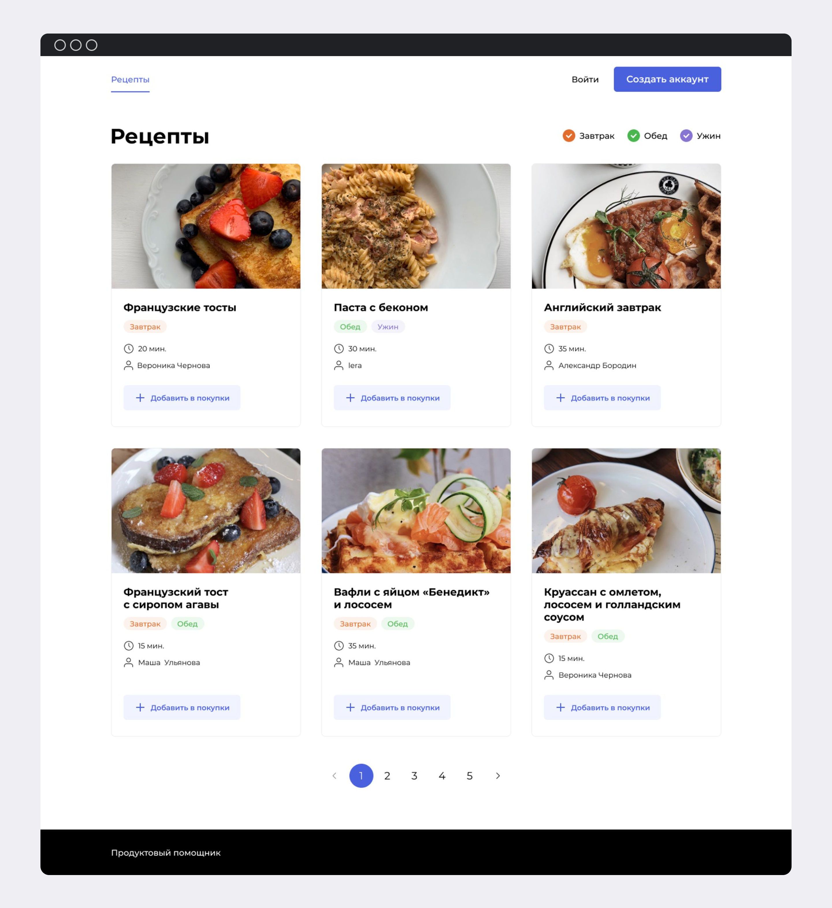

# Foodgram, Дипломный проект [Яндекс Практикум](https://practicum.yandex.ru/backend-developer/).

## Информация для проерки проекта:

* Адрес [foodrecipes.webhop.me](https://foodrecipes.webhop.me/)

### Аккаунты пользователей:

| username  | password  | email                   |
|-----------|-----------|-------------------------|
| superuser | superuser | superuser@superuser.com |
| admin     | admin     | admin@admin.com         |
| auth_user | Asdfgh992 | auth_user@gmail.com     |

## Проект представляет собой платформу для публикации кулинарных рецептов.


На платформе реализованно:

* Пубилкация рецепта с картинкой, тегом, выбором ингредиентов, временем приготовления, названием и описанием.
* Редактирование рецепта.
* Просмотр общей ленты рецептов.
* Подписка на пользователя.
* Добавление рецепта в избранное.
* Создание списка покупок с возможностью загрузки списка необходимых ингредиентов.

## Запуск проекта через docker compose:

* `docker-compose.yml` - для сборки проекта локально.
* `docker-compose-production.yml` - для запуска проекта на сервере.

### Команды для запуска:

* `docker compose up`, `docker compose -f docker-compose-production.yml up` - для запуска контейнеров.
* `docker compose -f docker-compose.production.yml exec backend python manage.py migrate` - для выполнения миграций.
* `docker compose -f docker-compose.production.yml exec backend python manage.py collectstatic` - для собра статики
  бэкенда.
* `docker compose -f docker-compose.production.yml exec backend cp -r /app/collected_static/. /static/static_backend/` -
  для копирования статики.

## Локальный запуск проекта для разработки backend:

* С помощью [docker](https://www.docker.com/) запустить frontend и Nginx через файл `docker-compose.yml` из папки infra

```commandline
docker compose up
```

* Запустить backend сервер
  manage.py находится в backend/foodgram

```commandline
 python manage.py runserver
```

## managment-команды:

### 1. Добавление ингредиентов и единиц измерения в БД.

##### Скрипт находится в

`recipes/management/commands/csv_import.py`

##### Запуск:

```commandline
python manage.py csv_import
```

###### Передача CSV-файла:

```commandline
python manage.py csv_import /path_to_file/file.csv
```

Ожидаемая форма csv файла:

```text
абрикосовое варенье,г
абрикосовое пюре,г
абрикосовый джем,г
```

### 2. Создание группы с правами "admin".

##### Запуск:

```commandline
python manage.py create_admin_group
```